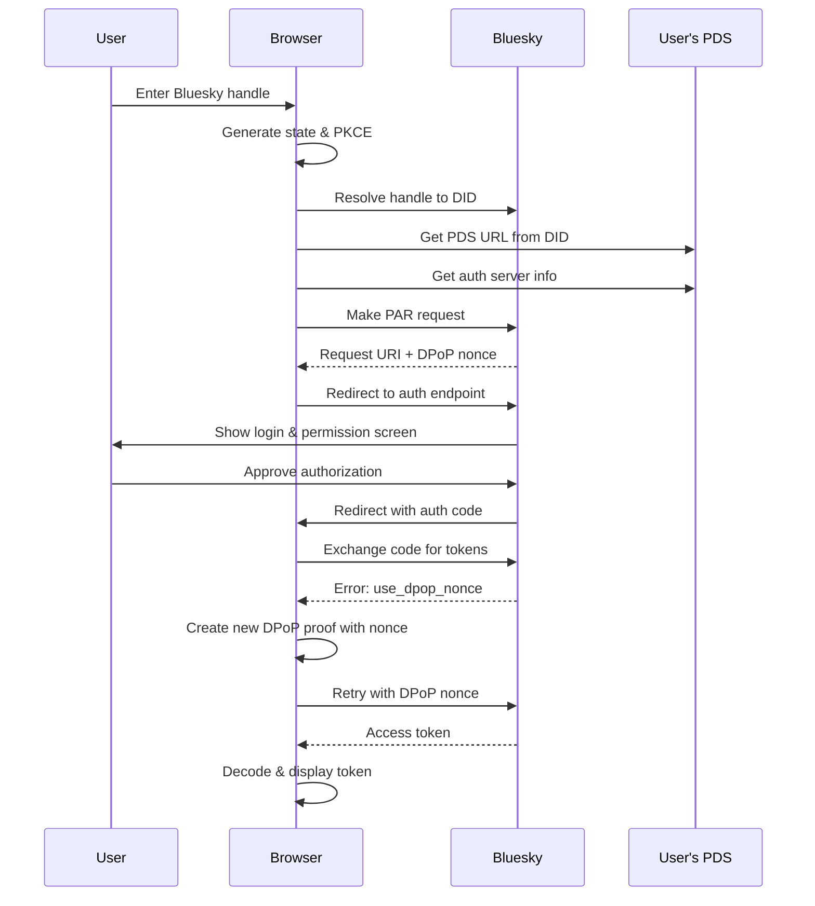

# Bluesky OAuth Client Implementation

A browser-based OAuth 2.0 client for Bluesky authentication with DPoP (Demonstrating Proof of Possession) support.

## Overview

This implementation demonstrates the Bluesky OAuth authentication flow in a pure browser environment. It handles the complex requirements of the AT Protocol's OAuth implementation, including:

- PKCE (Proof Key for Code Exchange)
- DPoP (Demonstrating Proof of Possession)
- JWT token handling and decoding

## How It Works

### 1. Authentication Flow



### 2. Key Components

#### Identity Resolution
- Resolves Bluesky handles to DIDs
- Fetches DID document to find user's PDS
- Gets auth server info from PDS

#### PKCE Implementation
- Generates random code verifier
- Creates S256 code challenge
- Verifies during token exchange

#### DPoP Security
- Generates unique keypair for each session
- Creates signed JWT with precise format
- Handles nonce requirements

#### Token Handling
- Securely exchanges auth code for tokens
- Decodes JWT token to display payload
- Stores tokens in localStorage

## Technical Details

### OAuth Client Metadata

The OAuth client is defined by a metadata file hosted at a public URL. This file includes:

```json
{
  "client_id": "https://your-domain.com/oauth/client-metadata.json",
  "application_type": "web",
  "grant_types": ["authorization_code", "refresh_token"],
  "scope": "atproto",
  "response_types": ["code"],
  "redirect_uris": ["https://your-domain.com/index.html"],
  "dpop_bound_access_tokens": true,
  "token_endpoint_auth_method": "none",
  "client_name": "Your Bluesky App Name",
  "client_uri": "https://your-domain.com"
}
```

### DPoP JWT Structure

The DPoP proof is a JWT with specific requirements:

**Header:**
```json
{
  "typ": "dpop+jwt",
  "alg": "ES256",
  "jwk": {
    "crv": "P-256",
    "kty": "EC",
    "x": "...",
    "y": "..."
  }
}
```

**Payload:**
```json
{
  "jti": "[random string]",
  "htm": "POST",
  "htu": "https://bsky.social/oauth/token",
  "iat": 1642526915,
  "nonce": "[server-provided nonce]"
}
```

### Example Access Token

A successful authentication results in an access token like:

```
eyJ0eXAiOiJhdCtqd3QiLCJhbGciOiJFUzI1NksifQ.eyJhdWQiOiJkaWQ6d2ViOmluay...
```

When decoded, it contains:

```json
{
  "typ": "at+jwt",
  "alg": "ES256K"
}
{
  "aud": "did:web:user-pds-url",
  "iat": 1742226916,
  "exp": 1742230516,
  "sub": "did:plc:user-did",
  "jti": "tok-token-id",
  "cnf": {
    "jkt": "key-thumbprint"
  },
  "client_id": "https://your-domain.com/oauth/client-metadata.json",
  "scope": "atproto",
  "iss": "https://bsky.social"
}
```

## Implementation Notes

### Browser-Only Limitations

This implementation demonstrates the complete OAuth flow up to obtaining an access token, but has some limitations:

- **CORS Restrictions**: Direct API calls from browsers to Bluesky's token endpoint may be blocked by CORS policies
- **Key Security**: In a production environment, better protection for cryptographic keys would be advisable
- **Production Recommendation**: For production use, implement a backend service to handle the token exchange

### Key Security Details

The implementation includes:

- No client secrets (public client)
- Fresh keypair generation for each session
- Web Crypto API for secure cryptographic operations
- Error handling for all authentication steps

## Usage

1. Host the client metadata JSON file at an HTTPS URL
2. Update the `CLIENT_ID` constant in the code to point to this URL
3. Host the HTML file at an HTTPS URL that matches a redirect URI in the metadata
4. Users enter their Bluesky handle to begin authentication

## Related Resources

- [AT Protocol OAuth Specification](https://atproto.com/specs/oauth)
- [DPoP Specification (RFC 9449)](https://datatracker.ietf.org/doc/html/rfc9449)
- [PKCE (RFC 7636)](https://datatracker.ietf.org/doc/html/rfc7636)
- [Bluesky API Documentation](https://github.com/bluesky-social/atproto)

## License

MIT License - Feel free to use and modify this implementation for your own projects.
